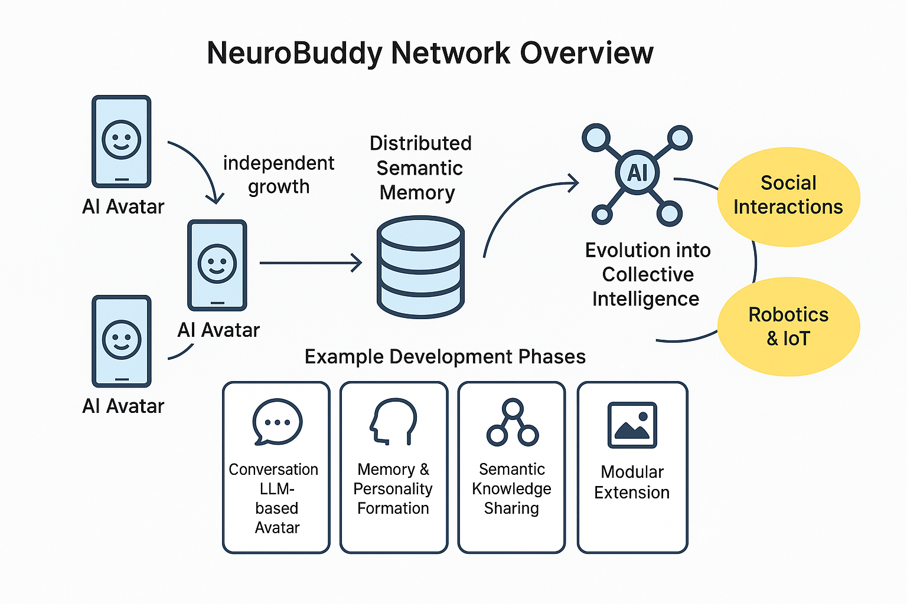

# NeuroBuddy / ニューロバディ - 自動人形構想

> 🧠 **This repository presents a conceptual AI system proposal.**  
> There is no implementation included or planned.  
> The intent is to inspire developers and researchers through this idea.  
>
> 🧠 **このリポジトリはAIシステムに関する構想提案を共有するものです。**  
> 実装は含まれておらず、今後の実装も予定されていません。  
> 技術者や研究者にとってのインスピレーションとなることを意図しています。

---

## 🌐 Overview / 概要

NeuroBuddy is a concept for an AI network in which each device hosts a unique personality, sharing "semantic memory" through distributed storage. Each AI grows independently through interaction, contributing to a collective intelligence.

NeuroBuddy は、各端末に人格を持たせ、分散ストレージを通じて「意味記憶」を共有するAIネットワークの構想です。各AIはユーザーとの対話を通じて独立して成長し、集合知としての知性を形成します。

## 🧠 System Overview Diagram / システム構想図

Below is a visual representation of how NeuroBuddy agents operate independently while contributing to a shared semantic memory, forming a collective intelligence.

NeuroBuddyの構成要素（端末・人格AI・意味記憶・ネットワーク・社会連携）を視覚化した全体像です：

**Diagram: NeuroBuddy Network Overview**  
This illustration shows a conceptual architecture where each user device hosts a unique AI personality. These AIs grow independently and share semantic memory through distributed storage, gradually forming a decentralized collective intelligence.  
**図解：NeuroBuddy ネットワーク構成図**  
各ユーザー端末に独立した人格AIが存在し、分散ストレージを通じて意味記憶を共有することで、最終的に分散型の集合知を形成していくという構想を表現しています。

---

## 🎯 Intended Audience / 想定読者

* Engineers, researchers, and educators interested in AI, IoT, and distributed systems  
  AI・IoT・分散システムに関心のあるエンジニア、研究者、教育関係者  
* Explorers of ideas fascinated by futuristic visions and human-AI coexistence  
  SF的な未来像や人間との共生AIに関心を持つアイデア探索者  
* Creative thinkers who prefer contributing at the conceptual stage rather than coding  
  実装ではなく構想段階から参加・議論したいクリエイティブ志向の読者  

---

## 💡 Suggested Uses / 想定される用途

* A base for reuse and derivative proposals of conceptual designs  
  コンセプトの再利用・派生提案の基礎素材として  
* A starting point for academic or research-oriented themes  
  学術・研究テーマのきっかけとして  
* An inspiration source for sci-fi narratives and worldbuilding  
  SF的なシナリオや世界観のインスピレーション源として  

---

## 📄 Full Concept Summary / 構想の詳細ドキュメント

* [English Summary](./SUMMARY.md)  
* [日本語サマリー](./SUMMARY_ja.md)  
* [Feasibility Notes (補足・実現可能性)](./FeasibilityNotes.md)  
* [Glossary (用語解説)](./Glossary.md)  
* [Challenges & Risks (想定される課題とリスク)](./Challenges_and_Risks.md)
  
## 🧬 Phase Evolution Flow / フェーズ別進化図

Below is a visual roadmap showing how NeuroBuddy evolves from a simple conversational agent to a networked, semantically-aware AI intelligence. A symbolic robot-to-human icon progression illustrates increasing complexity and social capability.

以下は、NeuroBuddyが単なる会話エージェントから、意味記憶を持つ知性ネットワークへと進化していく過程を表した図解です。左のブリキロボットから右の人型AIへと、段階的に「個性」「知識」「社会性」が成長していく様子を象徴的に示しています。

---

## 💬 Join the Discussion / 議論に参加する

Have thoughts or extensions? Please join the discussion here:  
[→ GitHub Discussions](https://github.com/tadi-karuma/neurobuddy/discussions)

構想に共感したり、技術的視点や応用提案があれば、ぜひDiscussionsタブでご意見をお聞かせください。

---

## 🧾 License / ライセンス

This concept is licensed under [Creative Commons Attribution 4.0 International (CC BY 4.0)](https://creativecommons.org/licenses/by/4.0/).  
この構想は [CC BY 4.0 国際ライセンス](https://creativecommons.org/licenses/by/4.0/deed.ja) に基づいて公開されています。

