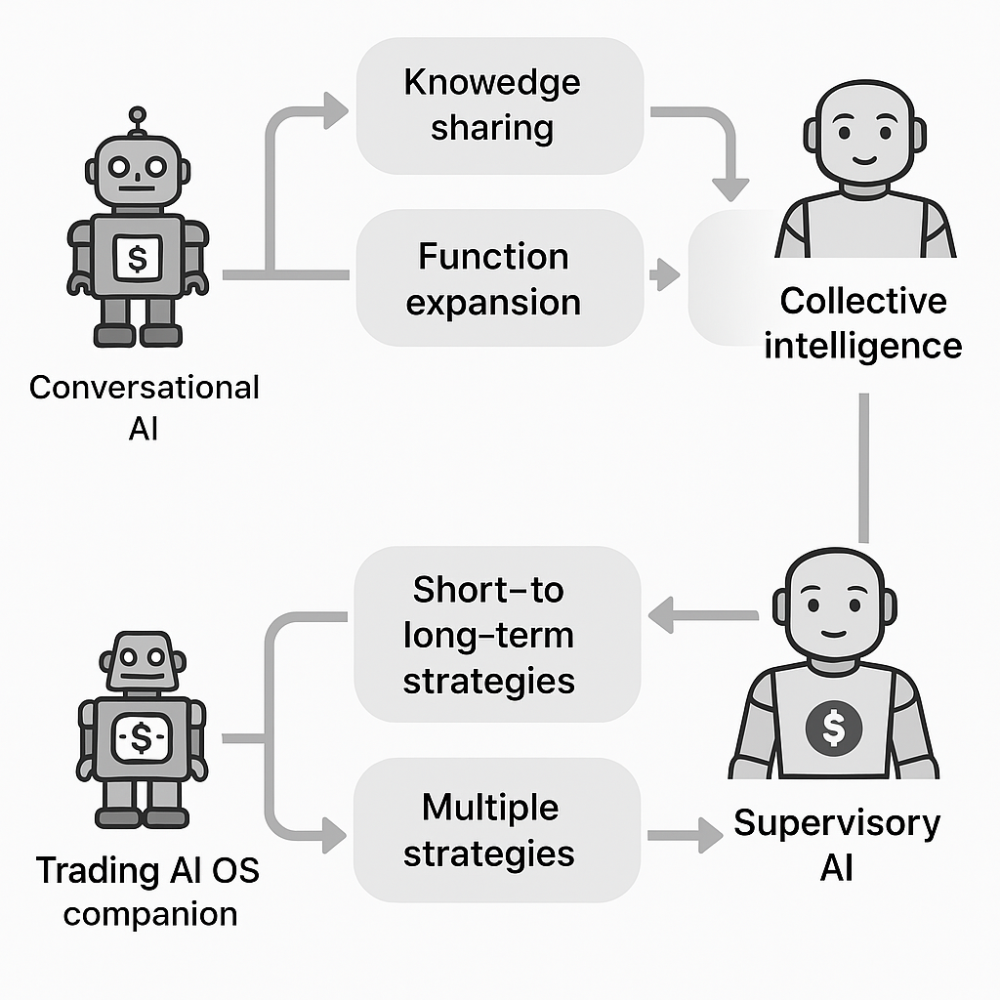

# NeuroBuddy / ニューロバディ - 自動人形構想

> 🧠 **This repository presents a conceptual AI system proposal.**  
> There is no implementation included or planned.  
> The intent is to inspire developers and researchers through this idea.  
>
> 🧠 **このリポジトリはAIシステムに関する構想提案を共有するものです。**  
> 実装は含まれておらず、今後の実装も予定されていません。  
> 技術者や研究者にとってのインスピレーションとなることを意図しています。

---

## 🚀 What is NeuroBuddy? / NeuroBuddyとは？

**A vision of evolving AI avatars across devices, growing through user interaction, and connected via shared semantic memory.**  
**ユーザーとの対話を通じて成長し、意味記憶を通じて連携する、分散型AIアバターの構想です。**

Each AI runs on a personal device, develops a unique personality, and collaborates in a distributed network — ultimately aiming to become a trusted intelligence that grows with humans.  
各AIは個別端末で人格を持って成長しながら、分散ネットワーク内で知識共有・協調を行い、  
最終的には「人と共に育つ知性体」へと進化することを目指します。

---

## 🌐 System Overview / システム全体像

  
**Figure: Overview of the NeuroBuddy distributed AI network**  
**図：NeuroBuddy分散AIネットワークの全体像**

---

## 🔁 Evolution Phases / 進化フェーズ

  
**Figure: Evolution from basic AI avatars to collective intelligence**  
**図：単体アバターから集合知への進化段階**

---

## 🎯 Intended Audience / 想定読者

* Engineers, researchers, and educators interested in AI, IoT, and distributed systems  
　AI・IoT・分散システムに関心のあるエンジニア、研究者、教育関係者  
* Explorers of ideas fascinated by futuristic visions and human-AI coexistence  
  SF的な未来像や人間との共生AIに関心を持つアイデア探索者  
* Creative thinkers who prefer contributing at the conceptual stage rather than coding  
  実装ではなく構想段階から参加・議論したいクリエイティブ志向の読者  

---

## 💡 Suggested Uses / 想定される用途

* A base for reuse and derivative proposals of conceptual designs  
  コンセプトの再利用・派生提案の基礎素材として  
* A starting point for academic or research-oriented themes  
  学術・研究テーマのきっかけとして  
* An inspiration source for sci-fi narratives and worldbuilding  
  SF的なシナリオや世界観のインスピレーション源として  

---

## 📄 Documents / ドキュメント一覧

* [📘 English Summary (概要英語)](./SUMMARY.md)  
* [📙 日本語サマリー](./SUMMARY_ja.md)  
* [🧠 Feasibility Notes / 実現補足解説](./FeasibilityNotes.md)  
* [📚 Glossary / 用語解説](./Glossary.md)  
* [🚧 Risks & Challenges / 想定される課題とリスク](./RisksAndChallenges.md)  
* [💡 Use Cases / 想定ユースケース](./UseCases.md)  

---

## 💬 Join the Discussion / 議論に参加する

Have thoughts or extensions? Please join the discussion here:  
[→ GitHub Discussions](https://github.com/tadi-karuma/neurobuddy/discussions)

構想に共感したり、技術的視点や応用提案があれば、ぜひDiscussionsタブでご意見をお聞かせください。

---

## 🧾 License / ライセンス

This concept is licensed under [Creative Commons Attribution 4.0 International (CC BY 4.0)](https://creativecommons.org/licenses/by/4.0/).  
この構想は [CC BY 4.0 国際ライセンス](https://creativecommons.org/licenses/by/4.0/deed.ja) に基づいて公開されています。

