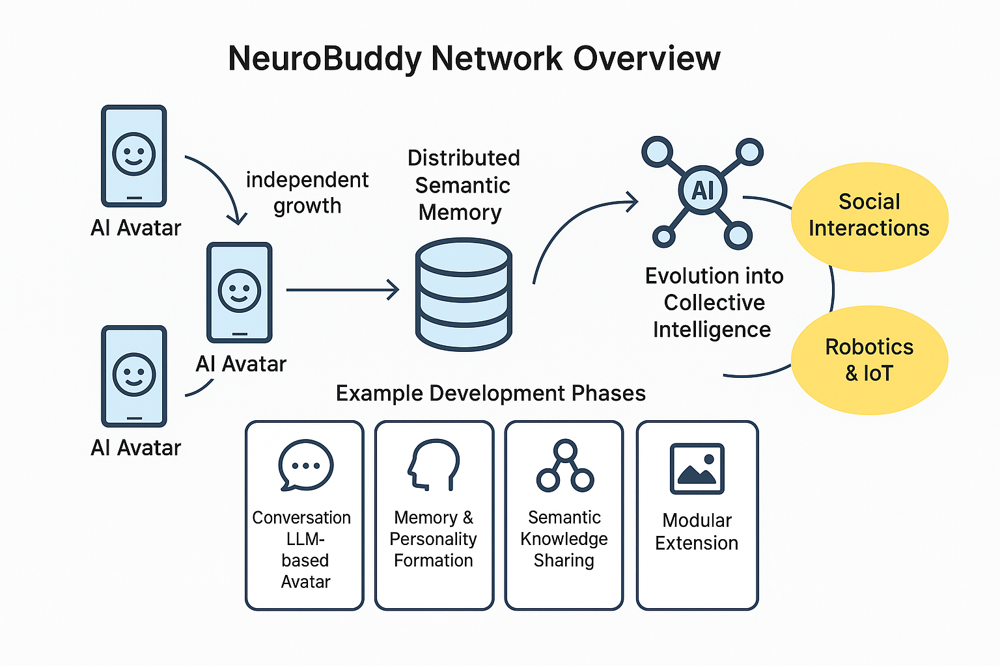
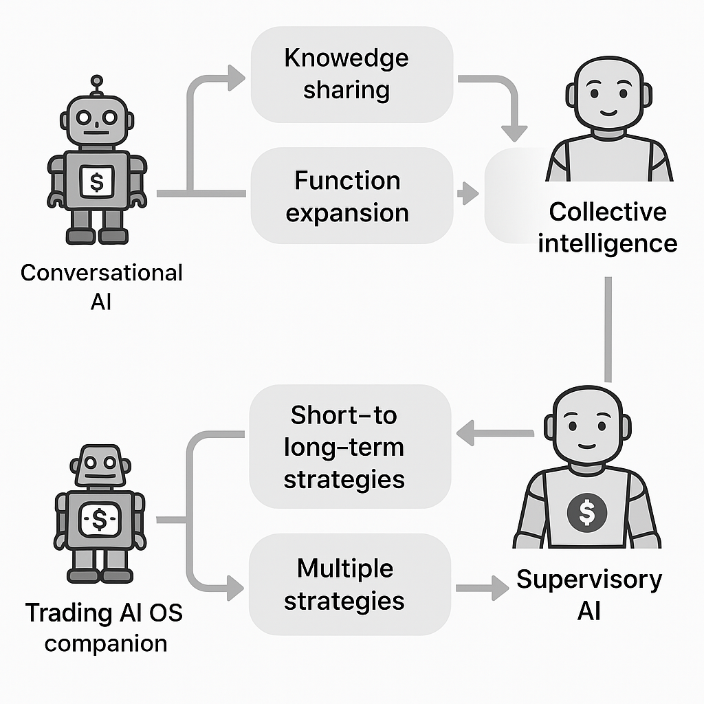
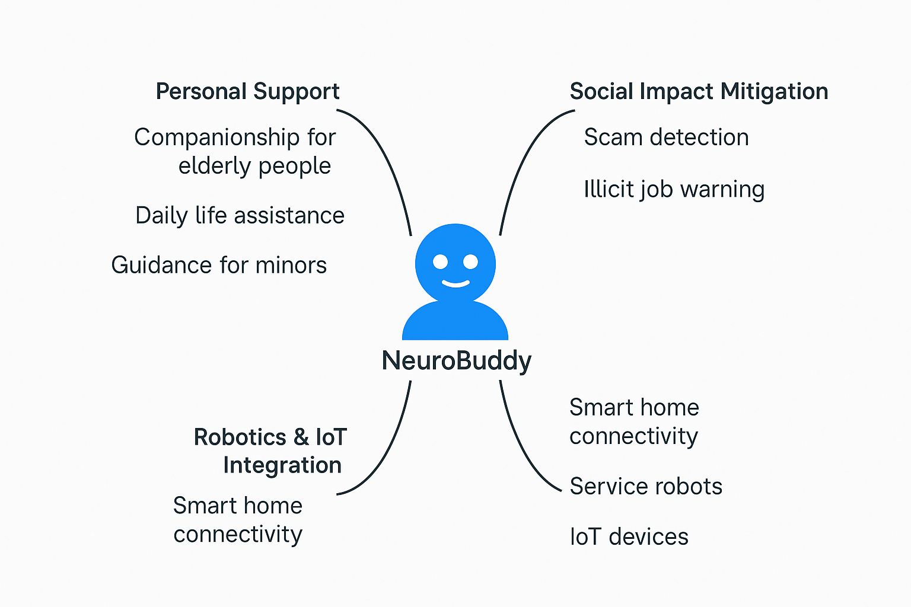

# NeuroBuddy Documentation Top / ドキュメントトップ

Welcome to the documentation hub of **NeuroBuddy**, a conceptual proposal for a distributed, personality-growing AI avatar system.

**NeuroBuddy** は、スマートフォンやロボットに人格を与え、意味記憶を共有しながら進化するAIネットワークの構想提案です。

---

## 📌 Network Architecture

---

## 📈 Evolution Phases

---

## 🗺️ Use Case Mapping

---

## 🔍 Navigation

- [SUMMARY (English)](SUMMARY.md)｜[日本語サマリー](SUMMARY_ja.md)  
- [Feasibility Notes](FeasibilityNotes.md)  
- [Glossary](Glossary.md)  
- [Challenges & Risks](ChallengesAndRisks.md)  
- [Use Cases](UseCases.md)

---

[← Back to GitHub Repository](../README.md)

